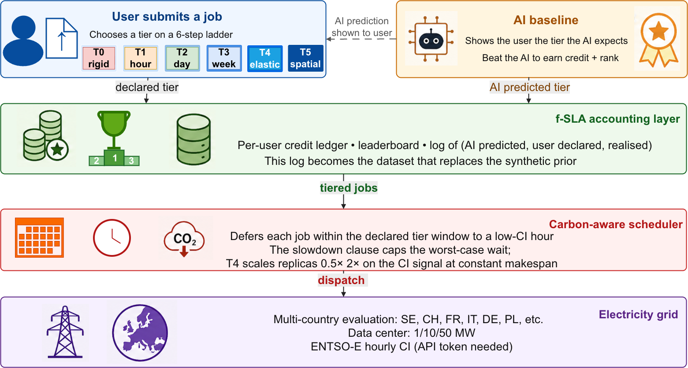
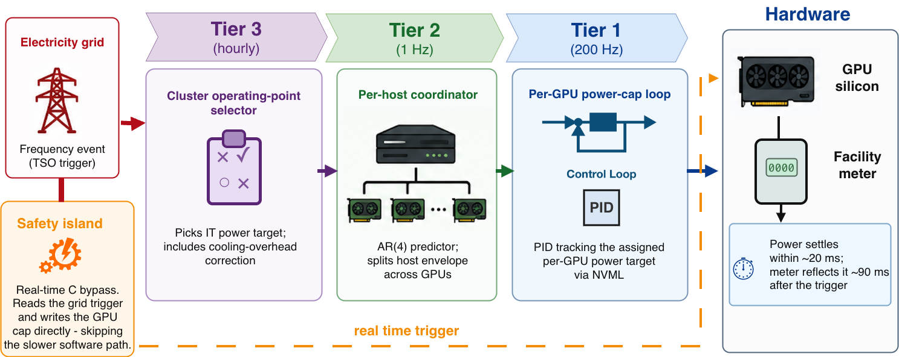

# GridPilot — Grid-Responsive Control for AI Supercomputers

[](LICENSE)
[](licenses/CC-BY-4.0.txt)

Open reproducibility kit for the two companion Euro-Par 2026 Workshop papers on flexible, grid-responsive AI/HPC supercomputers — one on the upstream user-side contract (PECS 2026), one on the downstream sub-second actuation controller (WHPC 2026). The kit also exposes a broader toolset for grid-services research beyond the published headlines (Tier-2 utilities in `docs/RELEASE_CONTENTS.md`).

## What this kit is

GridPilot is two complementary layers that compose vertically:

- **Downstream actuation (WHPC 2026):** a three-tier predictive controller (per-GPU at 200 Hz, per-host at 1 Hz, per-cluster hourly) plus an out-of-band safety-island bypass, validated on a real 3× NVIDIA V100 SXM2 testbed. Median end-to-end Fast-Frequency-Reserve response is ≈ 97 ms (max ≤ 102 ms across 90 trials), ~7× faster than the 700 ms Nordic FFR budget. A four-component instantaneous PUE correction reconciles the IT-side commitment with the facility-meter settlement, closing 2.5–5.8 pp of cooling-overhead drag across six European grids.
- **Upstream contract (PECS 2026):** the *f-SLA* — a six-tier ladder (T0 rigid, T1 hour, T2 day, T3 week, T4 elastic burst, T5 spatial) under which job submitters declare deferrability, elasticity, and spatial flexibility in exchange for proportional service credits. Four anti-gaming mechanisms M0–M3 are evaluated for non-obvious manipulability against a synthetic-user prior. The headline replay is on the Marconi100 (M100) production trace against six European grids (SE, CH, FR, IT, DE, PL) using ENTSO-E hourly carbon intensity.

The two layers compose vertically: user-side declarations elicit flexibility, the controller dispatches it deterministically at the facility meter. GridPilot also positions as the grid-facing layer of the emerging HPC PowerStack, composing with in-cluster power managers (PowerSched, EAR, GEOPM) through the REGALE DDS bus and aligning with the EuroHPC JU SEANERGYS reference architecture.

## Architecture at a glance

### Upstream — f-SLA contract + carbon-aware scheduler (PECS 2026)

The user-side path: job submitters declare a tier on a six-step flexibility ladder; an AI baseline shows the tier the system expects ("beat the AI to earn credit"); the f-SLA accounting layer logs *(predicted, declared, realised)* triples and maintains the credit/leaderboard ledger; the carbon-aware scheduler defers each job within its declared tier window to a low-CI hour (T4 instead scales replicas 0.5×–2× on the CI signal at constant makespan).



### Downstream — three-tier controller + safety island (WHPC 2026)

The facility-side path: a TSO frequency trigger drops into the out-of-band *safety island* (real-time-C bypass, GPU cap written directly), and in parallel cascades through the three software tiers — Tier 3 (hourly) cluster operating-point selector with cooling-overhead correction, Tier 2 (1 Hz) per-host coordinator with AR(4) prediction, Tier 1 (200 Hz) per-GPU PID over NVML. Power settles within ~20 ms at the GPU and the facility meter reflects it ~90 ms after the trigger.



## Release scope

- **This repository contains:** `gridpilot/` — the code, configs, data, and reproducibility scripts for both papers.
- A complete inventory of what ships, with audit-trail references, is in [`docs/RELEASE_CONTENTS.md`](docs/RELEASE_CONTENTS.md).

## Quick start

```bash
# From the gridpilot/ directory:
python3 -m venv .venv && source .venv/bin/activate
pip3 install --upgrade pip setuptools wheel
pip3 install -r requirements.txt

# Smoketest (single cell, ~30 s):
PYTHONPATH=experiments_v2/src python3 \
    experiments_v2/scripts/01_single_cell_smoketest.py

# Tests (under 30 s):
PYTHONPATH=src pytest -q tests/
```

## Reproduce the published results

### PECS 2026 — the f-SLA contract

```bash
# 1. Headline taxonomy sweep + mechanism sweep (~20 min on 4 workers).
PYTHONPATH=experiments_v2/src python3 \
    experiments_v2/scripts/04c_run_taxonomy_sweep.py
PYTHONPATH=experiments_v2/src python3 \
    experiments_v2/scripts/04d_run_mechanism_sweep.py

# 2. Render the three PECS figures + extract macros into results.tex.
PYTHONPATH=experiments_v2/src python3 \
    experiments_v2/scripts/07_render_seasonal_figure.py
PYTHONPATH=experiments_v2/src python3 \
    experiments_v2/scripts/09_render_paper_figures.py
PYTHONPATH=experiments_v2/src python3 \
    experiments_v2/scripts/11_render_mechanism_figure.py
PYTHONPATH=experiments_v2/src python3 \
    experiments_v2/scripts/10_extract_paper_macros.py \
    --tax-csv  experiments_v2/data/taxonomy_sweep/TAXONOMY_SUMMARY.csv \
    --mix-csv  experiments_v2/data/taxonomy_sweep/TAXONOMY_MIX.csv \
    --raw-csv  experiments_v2/data/taxonomy_sweep/taxonomy_sweep.csv \
    --mech-csv experiments_v2/data/mechanism_sweep/MECHANISM_SUMMARY.csv \
    --out      ../papers/pecs2026/figs/results.tex
```

### WHPC 2026 — the GridPilot controller

```bash
# 1. Hardware experiments (on a comparable 3xV100 SXM2 node).
PYTHONPATH=scripts python3 scripts/v100/experiments/E2_inner_loop_step_response.py
PYTHONPATH=scripts python3 scripts/v100/experiments/E3_outer_loop_tracking.py
PYTHONPATH=scripts python3 scripts/v100/experiments/E4_closed_loop_demand_following.py
PYTHONPATH=scripts python3 scripts/v100/experiments/E7_ffr_activation_latency.py

# 2. Multi-country PUE-aware sweep (same 04c driver, PUE-aware variant).
PYTHONPATH=experiments_v2/src python3 \
    experiments_v2/scripts/04c_run_taxonomy_sweep.py --pue-aware

# 3. Re-render V100 figures from raw telemetry.
PYTHONPATH=scripts python3 scripts/v100/replot_with_real_data.py
```

Full hardware reproduction takes ≤ 48 GPU-hours on a comparable 3× V100 SXM2 testbed. The carbon-aware contract replay is CPU-only and completes in under 30 minutes on 4 workers.

## Repository structure

```
gridpilot/
├── README.md                       ← this file
├── LICENSE                         ← MIT (code, scripts, configs)
├── CONTRIBUTING.md                 ← how to extend the framework
├── LIMITATIONS.md                  ← scope caveats and lessons learned
├── requirements.txt                ← Python environment specification
├── src/                            ← controller + scheduler library
│   ├── controller/                 ← Tier-1/2/3 PID/AR(4)/cluster controllers
│   ├── cooling/                    ← four-component PUE model
│   ├── scheduler/                  ← f-SLA ladder + M0–M3 mechanisms
│   └── integration/                ← RAPS adapter (PUE anchor) + ENTSO-E
├── experiments_v2/                 ← AUTHORITATIVE pipeline (see AUDIT_FINDINGS.md)
│   ├── README.md
│   ├── AUDIT_FINDINGS.md           ← F1–F5 audit; v1 bugs and the v2 fixes
│   ├── METRICS.md
│   ├── REALISM.md
│   ├── PROVENANCE.md
│   ├── src/                        ← shared accounting + workload taxonomy
│   │   └── schedulers/             ← fsla_carbon_aware + canonical baselines
│   ├── scripts/
│   │   ├── 00_unit_audit.py        ← closed-form sanity tests
│   │   ├── 01_single_cell_smoketest.py
│   │   ├── 04c_run_taxonomy_sweep.py    ← headline PECS Table 2 + WHPC E8
│   │   ├── 04d_run_mechanism_sweep.py   ← PECS Table 3 (M0–M3)
│   │   ├── 07_render_seasonal_figure.py
│   │   ├── 09_render_paper_figures.py
│   │   ├── 10_extract_paper_macros.py
│   │   ├── 11_render_mechanism_figure.py
│   │   └── test_fsla_scheduler.py
│   ├── data/
│   │   ├── taxonomy_sweep/         ← TAXONOMY_SUMMARY.csv + per-cell JSONs
│   │   └── mechanism_sweep/        ← MECHANISM_SUMMARY.csv
│   └── figs/paper/                 ← 5 rendered PDFs + results.tex
├── scripts/                        ← entry-point scripts (paper + utility)
│   ├── m100/
│   │   ├── fetch_real_ci_series.py ← ENTSO-E A75+A11 consumption-mix fetcher
│   │   └── build_extended_trace.py ← F4-fixed trace builder
│   ├── v100/                       ← WHPC hardware controller stack
│   │   ├── controller/             ← Tier-1/2/3 controller
│   │   ├── experiments/E{2..7}_*.py
│   │   ├── safety_island/          ← TLA+-spec'd safety-island simulator
│   │   ├── workloads/              ← three workload archetypes
│   │   ├── figure_scripts/
│   │   └── tests/
│   ├── pue_model/cooling_decomposition.py     ← four-component PUE (WHPC §3.3)
│   ├── projection/multiyear_50mw.py           ← multi-year facility-scale projection
│   ├── sensitivity/run_plackett_burman.py     ← PB screening on dispatcher hyperparameters
│   ├── workflows/                  ← synthetic DAG generators + replay
│   ├── simulator/                  ← validate_country_config + live ENTSO-E + telemetry
│   ├── raps_adapter/               ← RAPS YAML reader (PUE anchor)
│   └── figures/_figstyle.py        ← shared matplotlib style
├── data/                           ← bundled traces + telemetry (CC-BY 4.0)
│   ├── traces/m100_real_jobs_extended.parquet
│   ├── ci/entsoe/                  ← 6 hourly CI parquets
│   └── v100_raw/                   ← raw V100 measurement campaign
├── configs/                        ← per-country YAML + RAPS PUE anchor
├── raps/                           ← ExaDigiT/RAPS submodule (read-only)
├── docs/                           ← protocols + reproducibility documentation
│   ├── RELEASE_CONTENTS.md         ← canonical "what ships and why"
│   ├── ARCHITECTURE.md             ← three-tier controller details
│   ├── DATASETS.md                 ← M100, ENTSO-E, RAPS datasets
│   ├── FSLA_PROTOCOL.md            ← f-SLA contract specification
│   ├── GLOSSARY.md                 ← acronyms + terminology
│   ├── RATIONALE.md                ← design decisions
│   ├── CONFIGURE_NEW_COUNTRY.md    ← how to add a country
│   ├── COUNTRY_PARAMETER_SOURCES.md
│   ├── EXADIGIT_RAPS_SETUP.md
│   └── V100_MEASUREMENT_PROTOCOL.md  ← WHPC hardware-campaign protocol
├── tests/                          ← pytest suite
├── benchmarks/                     ← micro-benchmarks
└── licenses/                       ← third-party data licence acknowledgements
```

## RAPS integration

The kit bundles a copy of the ExaDigiT/RAPS repository under `raps/` as a read-only submodule and consumes its canonical system configuration `raps/config/marconi100.yaml` as the calibration anchor for the four-component PUE model. We **do not** run the RAPS simulation engine — see `experiments_v2/AUDIT_FINDINGS.md` §5 for the post-mortem on why the RAPS scheduler integration was withdrawn (the RAPS dataloader requires the PM100 published-telemetry schema which the raw M100 `sacct` dump does not provide).

The bridge is `src/integration/raps_config_adapter.py`. Two calibration cross-checks ship under `scripts/raps_adapter/` and are documented as Tier-2 utilities in `docs/RELEASE_CONTENTS.md`.

## Tests

```bash
PYTHONPATH=src pytest -q tests/
```

Tests cover: f-SLA tier ladder + Dirichlet prior; M0–M3 mechanisms + social-welfare functions + Jain's fairness; PUE-aware scheduler invariants; RAPS YAML adapter; ENTSO-E CI loader; scheduler error paths; CLI round-trip. Network-independent; finishes in under 30 s.

## Audit trail

This kit is the v2 pipeline; the v1 dispatcher and its drivers were archived as part of the pre-release cleanup because they had three load-bearing bugs (dead `pue_weight`, incompatible energy accumulators across baseline and treatment, end-of-window padding in `completed`). The audit is `experiments_v2/AUDIT_FINDINGS.md`; the cleanup driver that produced this kit is `papers/pecs2026/cleanup_dev_archive.sh` (documented in `papers/pecs2026/PRE_RELEASE_CLEANUP.md`).

If you find a discrepancy between a paper claim and a script output, the canonical chain of evidence is:

1. paper claim → `papers/<paper>/figs/results.tex` macro
2. → `experiments_v2/data/<sweep>/SUMMARY.csv` row
3. → per-cell JSON in `experiments_v2/data/<sweep>/cells/`
4. → script `experiments_v2/scripts/04c_run_taxonomy_sweep.py` (or 04d)
5. → dispatcher `experiments_v2/src/schedulers/fsla_carbon_aware.py`
6. → accounting `experiments_v2/src/accounting.py`

## Citations

If you use this kit, please cite the two companion papers:

```
@inproceedings{gridpilot-whpc-2026,
  author    = {Constantinescu, Denisa-Andreea and Atienza, David},
  title     = {{GridPilot}: Real-Time Grid-Responsive Control for {AI} Supercomputers},
  booktitle = {Proceedings of Euro-Par 2026 Workshops (WHPC)},
  year      = {2026}
}

@inproceedings{fsla-pecs-2026,
  author    = {Anonymous (double-blind)},
  title     = {{f-SLA}: A User-Side Contract for Truthful Workload Flexibility towards Carbon-Free Supercomputing},
  booktitle = {Proceedings of Euro-Par 2026 Workshops (PECS)},
  year      = {2026}
}
```

## Licensing

- Code, scripts, configs: MIT (`LICENSE`).
- Data, bundled traces, telemetry: CC-BY 4.0 (`licenses/CC-BY-4.0.txt`).
- Third-party acknowledgements: `licenses/THIRD_PARTY.md`.
